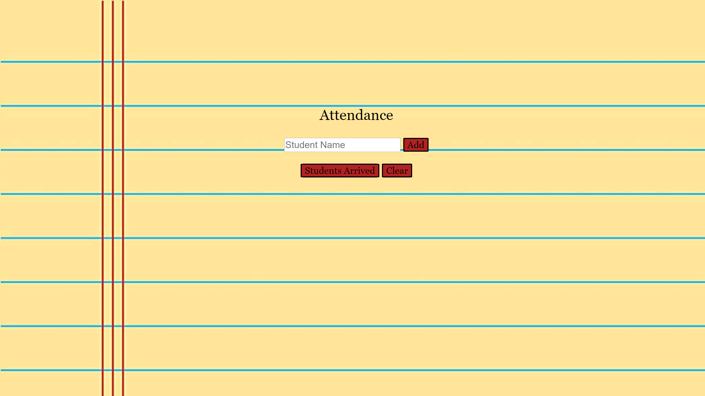

# Student Attendance Sheet
This is an attendance list application that allows the teacher to submit student names as they enter the classroom, and then click on a button to display all the names of the students.

## How It's Made:

**Tech used:** HTML, CSS, JQuery

This application is built with students name submitted through an input and stored in a global array. The add button is set to an event listener that listens for the click and pushes the input value to the array. The student arrived button is also set to an event listener and listens for the click, and then append to the DOM all the students name in html li. The clear button removes all li on the DOM to clear names.

## Lessons Learned:

I learned to write shorthand syntax with using JavaScript JQuery library. The JQuery library comes with shorthand methods to easily append HTML elements to the DOM and set event listeners for elements from the DOM.
